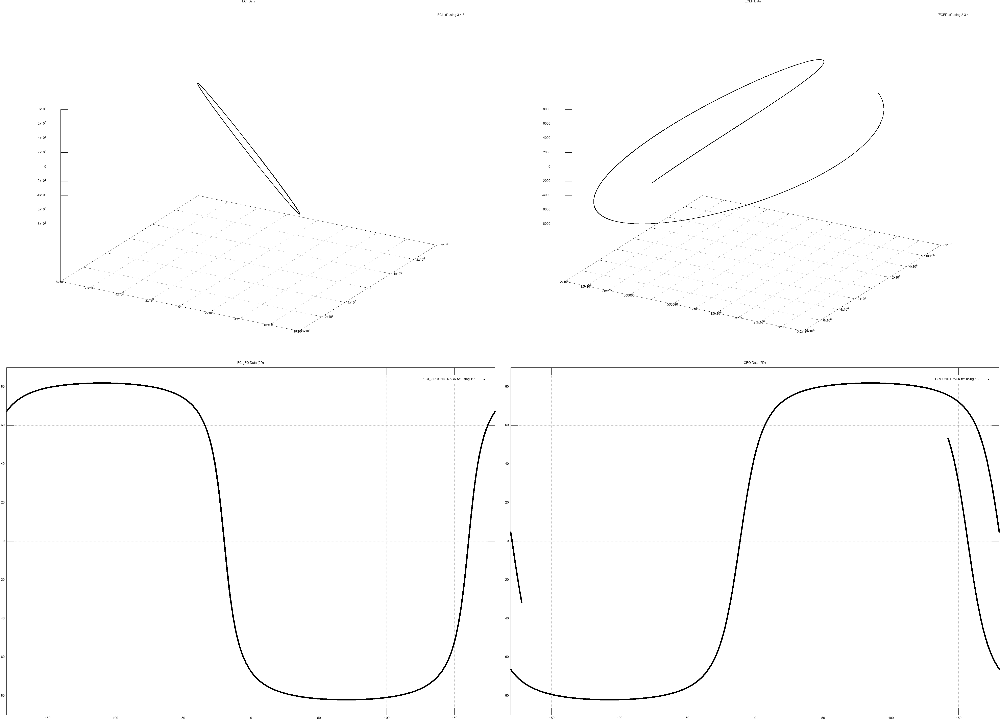

# Resulting Plot

<p align="center">
  
</p>


# Orbit_Determination


This code serves the purpose for orbit determination of a satellite orbiting aroung Earth with the effect of J2 perturbation. 
The code takes in classical orbital element (SMA, e, i, RAAN, &omega;, &nu;) into account to calculate and iterate the final position and velocity vector

- SMA  : Semi-Major axis,
- e    : Eccentricity,
- i    : Inclination,
- RAAN : Right Ascension of Ascending Node,
- &omega;: Argument of periapsi,
- &nu; : True Anomaly.

This code takes in the argument from the file "input.txt" in the root folder
> [!IMPORTANT]
> Specific format must be following as indicated in the example input.txt file

# Usage
The repository compiles using cMake. To compile the program, move to the build directory

```command line
mkdir build
cd build
```

and run 
```command line
cmake ..
make test
```
The target test case will propagte the orbit as well as plot and open the plot for visualisation when completed.


# Mathematical Formulas
## Orbital Equation

In this section, we provide two important formulas related to orbital mechanics.

The formula for calculating the orbital radius (r) is given by:

$$
r = \frac{h^2}{\mu}\frac{1}{1+e\sin\theta}(\cos\theta\hspace{0.2cm}\mathbf{i}_e + \sin\theta\hspace{0.2cm}\mathbf{i}_p)
$$

The formula for calculating the orbital velcotiy (v) is given by:

$$
v = \frac{\mu}{h}(\sin\theta\hspace{0.2cm}\mathbf{i}_e + (e+\cos\theta)\hspace{0.2cm}\mathbf{i}_p)
$$

> [!IMPORTANT]
> The orbital coordinate are transformed from Perifocal to ECI

## Gravitational Model (JGM-3)

The orbital equation under gravitational acceleration and oblateness perturbation shown below,

$$
U = \frac{\mu}{r} \[1+\sum_{l=2}^{\infty}\sum_{m=0}^{l}(\frac{R_\oplus}{r})^lP_{l,m}(\sin\[\phi_{gc_{sat}})\]\{C_{l,m}\sin(m\lambda_{sat})+S_{l,m}\sin(m\lambda_{sat})\}\]
$$


$$
\begin{aligned}
  a_I &= \{\frac{1}{r}\frac{\partial U}{\partial r}-\frac{r_K}{r^2\sqrt{r_I^2+r_J^2}}\frac{\partial U}{\partial\phi_{gc_{sat}}} \}r_I -  \{\frac{1}{r_I^2+r_J^2}\frac{\partial U}{\partial\lambda_{sat}} \}r_J - \frac{\mu r}{r^3} \\
  a_J &= \{\frac{1}{r}\frac{\partial U}{\partial r}-\frac{r_K}{r^2\sqrt{r_I^2+r_J^2}}\frac{\partial U}{\partial\phi_{gc_{sat}}} \}r_J +  \{\frac{1}{r_I^2+r_J^2}\frac{\partial U}{\partial\lambda_{sat}} \}r_I - \frac{\mu r}{r^3} \\
  a_K &= \frac{1}{r}\frac{\partial U}{\partial r}r_K  + \frac{\sqrt{r_I^2+r_J^2}}{r^2}\frac{\partial U}{\partial\phi_{gc_{sat}}}- \frac{\mu r}{r^3}
\end{aligned}
$$

# Time Integration

For time-integration we will use 4th-order Runge-Kutta explicit scheme. This can be formulated as:

$$
y_{n+1} = y_n + \frac{1}{6}(k_1+2k_2+2k_3+k_4)\Delta t
$$

with 

$$
\begin{align}
    k_1 = f(y_n)\\
    k_2 = f(y_n + \Delta tk_1/2)\\
    k_3 = f(y_n + \Delta tk_2/2)\\
    k_4 = f(y_n + \Delta tk_3)\\
\end{align}
$$


